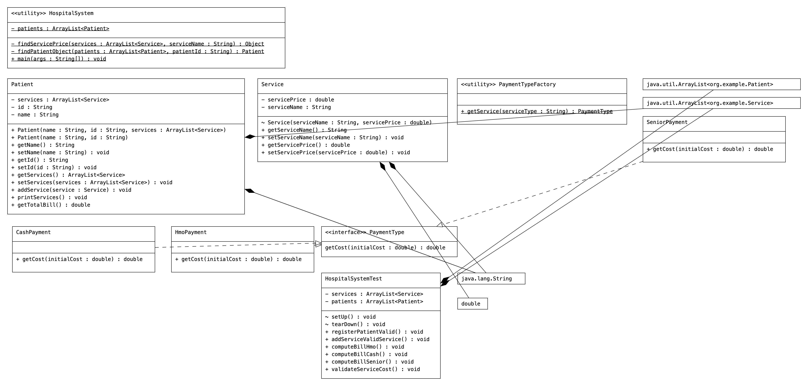
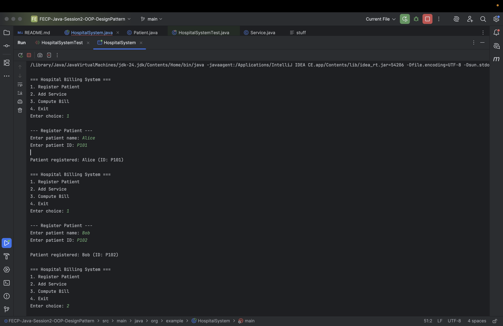
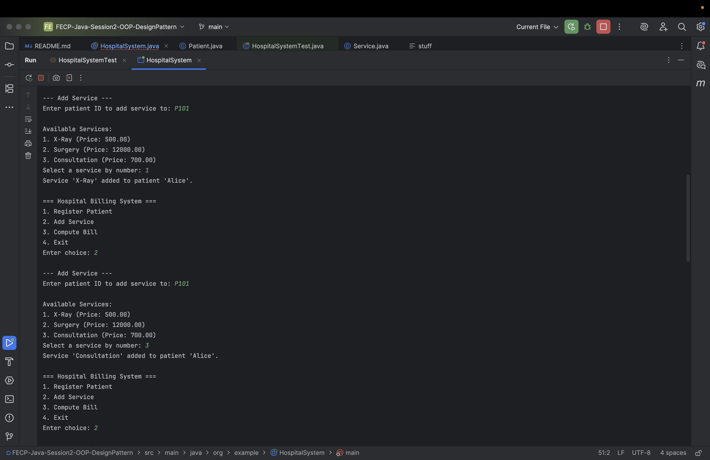
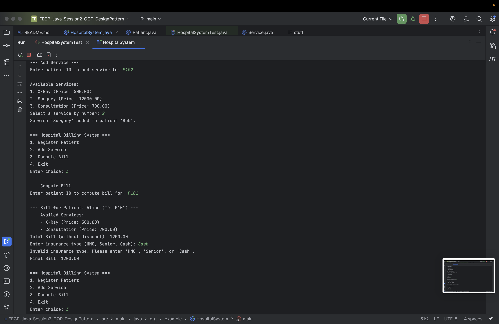
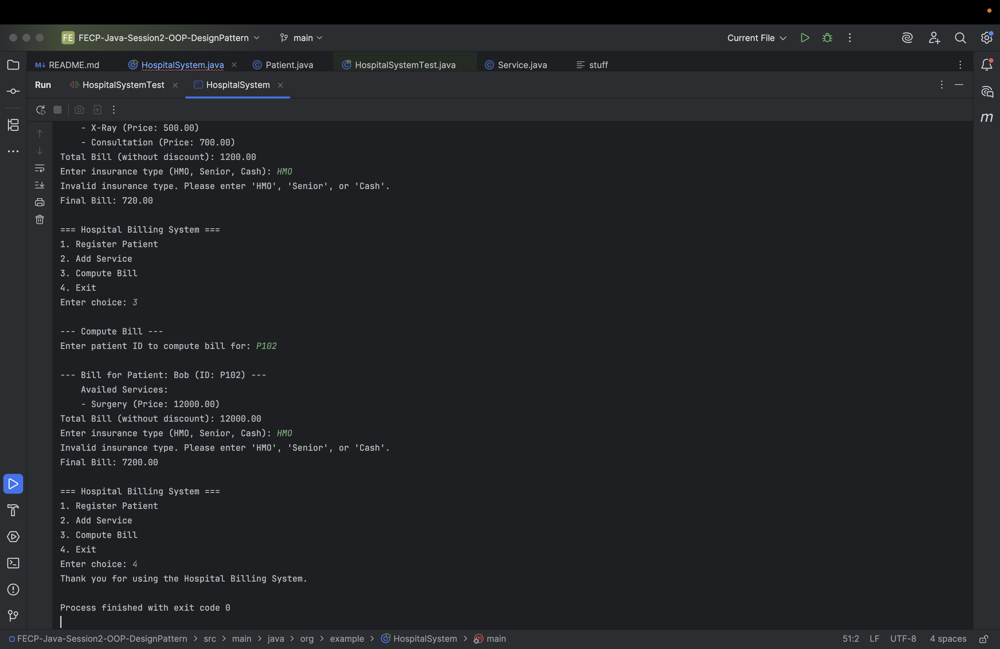

**Group Name:** Group 1  
**Group Members: **  
- Malit, General  
- Pajaron, Romielle  
- Serrano, Nuan Patricia  
**Project Title:** FECP-Java-Session2-OOP-Design Pattern / Lab 3: Java OOP Capstone Project  

**Brief Description of the Project:**
The project is a Java-based Hospital Billing System. The system features a menu with these key functions:  
- **Register Patients** - we create new patient records with a name and a unique ID. Patients initially have no availed services, which will be added on the next option.
- **Add Services** - given a Patient ID, we add their availed Services under their record.
- **Compute Bill** - given a Patient ID, we display a list of all services they have availed and calculate their total bill. We are also prompted to enter the insurance type (HMO, Senior, Cash), and we print the discounted price.
- **Exit** - exits the application.
 

**Project Structure:**
   

HospitalSystem - contains the main method  
PaymentTypeFactory - factory class for creating a payment type class  
PaymentType - interface for payment types (cash, hmo, senior)  
Patient - stores patient details  
Service - stores service names and prices  

**Screenshots:**
  
  
  
  
  
